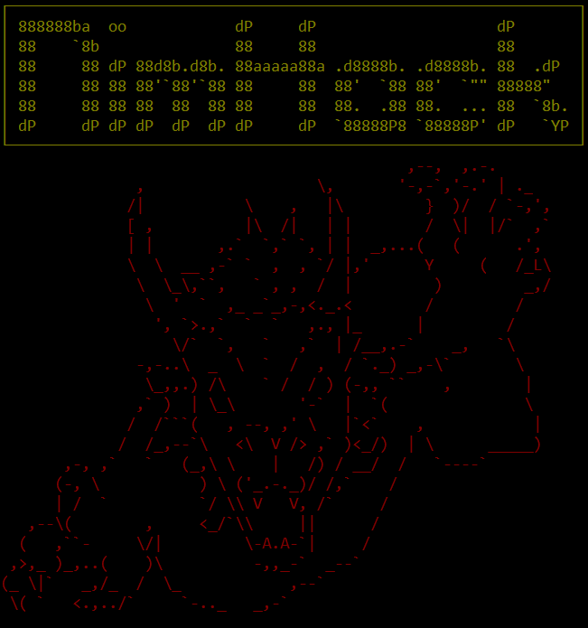

# NimHack


A fun project with the objective of copying Nethack in Nim

I'll be using this project as a way to learn more about game programming and to have some fun as well. I've always enjoyed Nethack type of games, which is why I chose to start this project.

**Controls:**  
```
Arrow Keys: movement
R: restart  
Q: quit  
 ```
**Future updates:**  
-~~Enemies and~~ good ~~combat~~ (With magic and all)  
-~~Hopefully remove the screen flickering completely~~  
-A ~~backpack~~ and an assortment of items  
-Other fun features that I'll add in the future once I finish those above  
